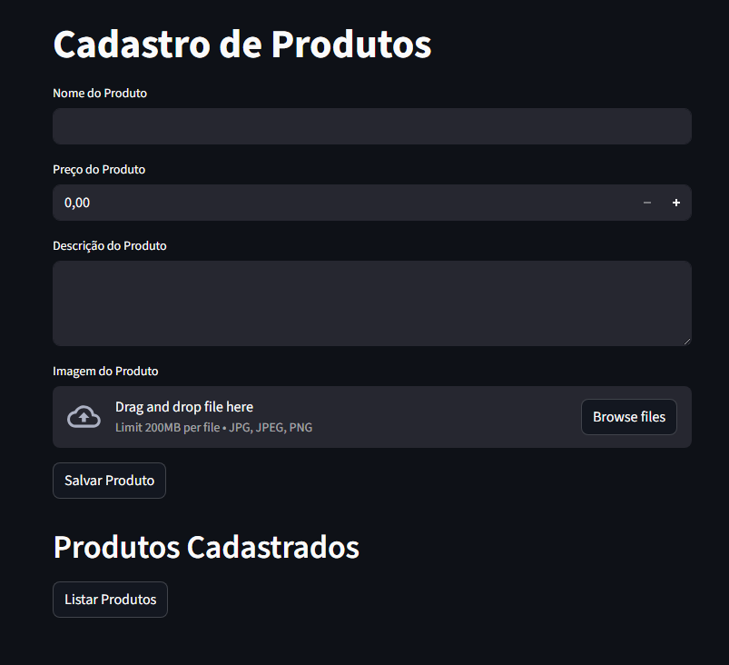

# Laboratorio Azure - Bootcamp DIO

Projeto desenvolvido por **Pedro Henrick** durante o Bootcamp de Azure na plataforma DIO.

## O que foi aprendido

Durante este módulo, aprendi a trabalhar com os principais serviços do Azure:

- **Azure Blob Storage**: Armazenamento de arquivos na nuvem
- **Azure SQL Database**: Banco de dados relacional gerenciado
- **Grupos de Recursos**: Organização e gerenciamento de recursos no Azure
- **Integração Python**: Conectar aplicações Python com serviços Azure

## Sobre o Projeto

Este é um sistema de cadastro de produtos desenvolvido com Streamlit. O sistema permite:

- Cadastrar produtos com nome, descrição, preço e imagem
- Armazenar imagens no Azure Blob Storage
- Salvar informações dos produtos em um banco de dados SQL no Azure
- Listar produtos cadastrados em formato de cards

## Um pouco do projeto

Tela inicial:



Adicionando algo:


Listando todos os produtos:


## Tecnologias Utilizadas

- Python 3.x
- Streamlit (interface web)
- Azure Blob Storage (armazenamento de imagens)
- Azure SQL Database (banco de dados)
- pymssql (conexão com SQL Server)

## Pré-requisitos

Antes de começar, você precisa ter:

- Python instalado na sua máquina
- Uma conta no Azure
- Recursos criados no Azure:
  - Storage Account com um container
  - SQL Database
  - Grupo de Recursos

## Como instalar

1. Clone ou baixe este repositório

2. Instale as dependências necessárias:

```bash
pip install -r requirements.txt
```

Ou instale manualmente cada pacote:

```bash
pip install streamlit
pip install azure-storage-blob
pip install pymssql
pip install python-dotenv
```

## Configuração

### 1. Configurar variáveis de ambiente

Crie um arquivo `.env` na raiz do projeto com suas credenciais do Azure:

```env
BLOB_CONNECTION_STRING = "sua_connection_string_do_blob"
BLOB_CONTAINER_NAME = "nome_do_seu_container"
BLOB_ACCOUNT_NAME = "nome_da_sua_storage_account"

SQL_SERVER = "seu_servidor.database.windows.net"
SQL_DATABASE = "nome_do_seu_banco"
SQL_USER = "seu_usuario"
SQL_PASSWORD = "sua_senha"
```

### 2. Configurar o Banco de Dados

Execute o seguinte comando SQL no Azure SQL Database para criar a tabela de produtos:

```sql
CREATE TABLE Produtos (
    id INT IDENTITY(1,1) PRIMARY KEY,
    nome NVARCHAR(255) NOT NULL,
    descricao NVARCHAR(MAX),
    preco DECIMAL(18, 2) NOT NULL,
    imagem_url NVARCHAR(2083)
);
```

### 3. Configurar Firewall do Azure

No portal do Azure:

- Acesse seu SQL Server
- Vá em "Networking" ou "Firewalls and virtual networks"
- Adicione seu endereço IP atual
- Ou marque a opção "Allow Azure services and resources to access this server"

## Como executar

Execute o comando abaixo no terminal:

```bash
streamlit run main.py
```

O sistema abrirá automaticamente no seu navegador padrão, geralmente em `http://localhost:8501`

## Como usar

1. **Cadastrar um produto:**
   - Preencha o nome do produto
   - Informe o preço
   - Adicione uma descrição
   - Faça upload de uma imagem (formatos aceitos: jpg, jpeg, png)
   - Clique em "Salvar Produto"

2. **Visualizar produtos:**
   - Clique em "Listar Produtos"
   - Os produtos serão exibidos em cards com 3 colunas

## Estrutura do Projeto

```
Laboratorio-DIO/
│
├── main.py              # Arquivo principal da aplicação
├── .env                 # Variáveis de ambiente (não versionar)
├── requirements.txt     # Dependências do projeto
├── infos.txt           # Informações sobre configuração do banco
└── README.md           # Este arquivo
```

## Funcionalidades

### Upload de Imagens

As imagens são enviadas para o Azure Blob Storage com um nome único (UUID) para evitar conflitos.

### Banco de Dados

Os produtos são armazenados em um banco SQL Server no Azure com as seguintes informações:

- ID (gerado automaticamente)
- Nome
- Descrição
- Preço
- URL da imagem

### Interface

A interface utiliza Streamlit para criar uma experiência web simples e intuitiva.

## Observações Importantes

- Nunca compartilhe suas credenciais do Azure
- O arquivo `.env` não deve ser enviado para repositórios públicos
- Sempre verifique se o firewall do Azure está configurado corretamente
- As imagens são armazenadas permanentemente no Blob Storage
- Certifique-se de que o container de blobs existe antes de executar o projeto

## Possíveis Problemas e Soluções

### Erro de conexão com o banco de dados

- Verifique se o firewall do Azure permite seu IP
- Confirme se as credenciais no arquivo `.env` estão corretas
- Certifique-se de que o servidor SQL está disponível

### Erro ao fazer upload de imagem

- Verifique se a connection string do Blob está correta
- Confirme se o container existe
- Verifique as permissões de acesso ao container

## Aprendizados

Este projeto me ajudou a entender:

- Como conectar uma aplicação Python com serviços em nuvem
- Gerenciamento de armazenamento de arquivos no Azure Blob Storage
- Trabalho com banco de dados SQL na nuvem
- Criação de interfaces web com Streamlit
- Organização segura de variáveis de ambiente
- Integração entre diferentes serviços do Azure

---

Desenvolvido durante o Bootcamp Azure - DIO por Pedro Henrick
